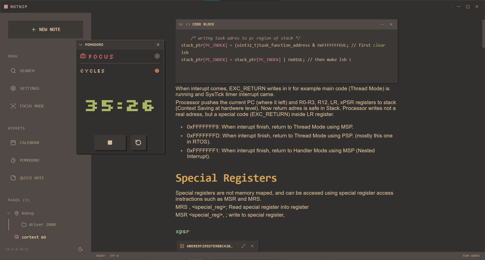

# Notnip

Notnip is a local note-taking application developed for low system usage and a chill writing experience.

The goal is to provide a warm, clear, and easy-on-the-eyes workspace where notes can be opened quickly. Notnip is currently being developed as a desktop application with a retro-gruvbox feel.

The project is developed as a personal side project. Major features planned for the future include an online workspace system that users can host on their own machines or small servers, diagram support, and a customizable grid-based layout system.



## What does it offer?

Notnip is a little more structured than classic plain text note-taking applications, but it tries not to feel as heavy as large productivity tools.

Different blocks can be added while writing with `/` commands. Some blocks provide additional options called "flags" that can be used while the block is being created. By typing `-` in a command, block-specific options can be displayed.

Notes, pages, subpages, and application data are stored on the computer. Notes can be exported in the `.notnip` format and imported again later. Markdown export is also supported, making it possible to move notes outside the application.

The application also includes small tools that support note-taking. Mini apps such as Pomodoro, calendar, and quick notes are included to help the workflow without interrupting the main writing experience.

PDF and image files are also supported inside note pages.

The interface is inspired by Gruvbox colors. Colors and some component behaviors can be customized from the settings.

## Running from source

Node.js and the Rust toolchain are required to develop or build Notnip locally.

Install dependencies:

```bash
npm install
````

Run in development mode:

```bash
npm run tauri dev
```

Build the application for production:

```bash
npm run tauri build
```

The built files are usually written to the following directory:

```text
src-tauri/target/release/bundle
```

## Roadmap

Short and mid-term goals for Notnip:

* maintain low system usage and data optimization,
* improve the comfort of the note-taking environment,
* add multiple fun mini apps and snippets for the user,
* expand flags and the block catalog,
* add more theme and visual style options,
* develop a self-hostable online workspace system,
* create shared workspaces with collaborators.

These items are not guaranteed release promises, but the direction the project aims to move toward.

## Contributing

Notnip started as a personal project, but the goal is to gradually turn it into an open source note-taking environment.

Ideas, any kind of feedback in particular, bug reports, and pull requests are welcome. For larger changes, opening an issue first is healthier.

## License

MIT License.
